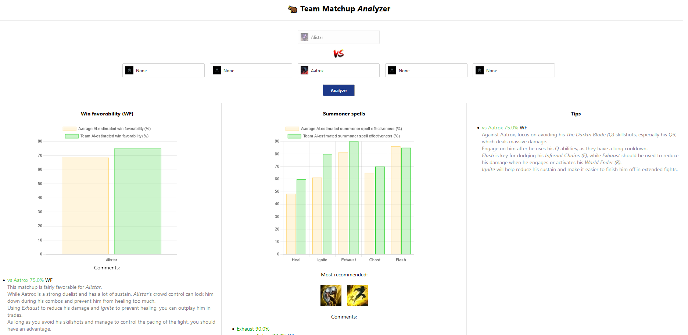

# LoL Alistar AI Matchup Analysis 

https://kvbc.github.io/lol-alistar-matchups/



Prompts used (GPT-4):

```
What sums for alistar:
- ghost: stick to enemy
- flash: surprise, dodge, instant
- ignite: ranged squishy
- heal: peel, close distance
- exhaust: all-ins

determine for all 140 champions in league, for each of them, in JSON format, give values from 0.0 to 1.0 (0% to 100%) for these categories:
- "ghost": how much do u need to "stick" to these champions over time, chase them, etc rather than instant flash
- "flash": how much u rather instant dodge surprise them with flash
- ignite: how ranged and squishy they are to rather use ignire on them
- heal: maybe ignite and exhaust no good then use heal how much?
- exhaust: how all-in are they
```

```
add a property that describes in text how to play against that champ
```

```
also rate the favouriness of winning the matchup from 0.0 to 1.0
```

For newer champions (2023+), such as Hwei, Smolder, and Ambessa, I've copy and pasted their wiki description.
